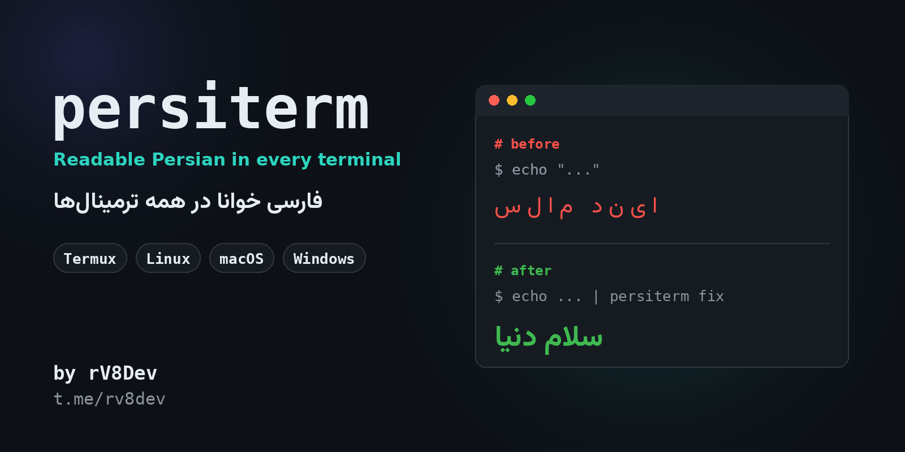

<p align="center">
  
</p>

<h1 align="center">persiterm</h1>

<p align="center">
  <b>فارسی خوانا در همه ترمینال‌ها</b><br>
  Termux · Linux · macOS · Windows
</p>

<p align="center">
  <a href="https://t.me/rv8dev">کانال تلگرام: @rv8dev</a>
</p>

---

<div dir="rtl" align="right">

## این چیست؟

اکثر ترمینال‌ها حروف فارسی را بهم نمی‌چسبانند و راست‌چین هم نمی‌کنند، برای همین حروف جدا و برعکس نمایش داده می‌شوند. **persiterm** این مشکل را به دو روش حل می‌کند:

1. **فیلتر متن:** حروف فارسی را بهم می‌چسباند و ترتیب نمایش را درست می‌کند تا هر خروجی خوانا شود.
2. **نصب فونت:** فونت [وزیرمتن](https://github.com/rastikerdar/vazirmatn) را دانلود و نصب می‌کند و اگر ترمینال اجازه بدهد، خودش تنظیمش می‌کند.

## نصب

پایتون ۳.۸ یا بالاتر لازم است.

```bash
git clone https://github.com/USERNAME/persiterm.git
cd persiterm
pip install .
```

**ترموکس:** اول این را بزنید:

```bash
pkg install python git
```

## استفاده

```bash
# درست کردن یک متن
persiterm print "سلام دنیا"

# درست کردن هر چیزی که با pipe بهش بدهید
echo "سلام دنیا" | persiterm fix
cat notes.txt | persiterm fix

# اجرای یک دستور و درست کردن خروجی‌اش
persiterm run ls -la

# نصب فونت فارسی
persiterm font
```

اگر ترمینال شما خودش RTL دارد (مثل mlterm)، از `persiterm fix --no-bidi` استفاده کنید، وگرنه متن دوبار برعکس می‌شود.

اگر دستور `persiterm` شناخته نشد (در ویندوز زیاد پیش می‌آید):

```bash
python -m persiterm.cli print "سلام"
```

## ترمینال‌های پشتیبانی‌شده

| ترمینال | فیلتر متن | نصب فونت | تنظیم خودکار فونت |
|---|:---:|:---:|:---:|
| Termux | ✅ | ✅ | ✅ |
| GNOME Terminal | ✅ | ✅ | ✅ |
| بقیه ترمینال‌های لینوکس (kitty، Alacritty، Konsole، xterm…) | ✅ | ✅ | ❌ دستی |
| ترمینال مک / iTerm | ✅ | ✅ | ❌ دستی |
| Windows Terminal | ✅ | ✅ | ❌ دستی |
| cmd / PowerShell قدیمی | ✅ | ✅ | ❌ ممکن نیست |

> در ویندوز به‌جای پنجره‌ی قدیمی cmd از **Windows Terminal** استفاده کنید. از *Settings ← Defaults ← Appearance* فونت را روی `Vazirmatn` بگذارید.

## محدودیت‌ها

- خروجی به ترتیب نمایشی است. آن را داخل کد یا فایل کپی نکنید.
- خطوط خیلی طولانی که در ترمینال wrap می‌شوند ممکن است خراب شوند.
- وزیرمتن کاملاً monospace نیست و ستون‌ها ممکن است کمی ناهم‌تراز دیده شوند.

## ارتباط

ساخته‌شده توسط **rV8Dev**

- کانال تلگرام: [@rv8dev](https://t.me/rv8dev)

</div>
